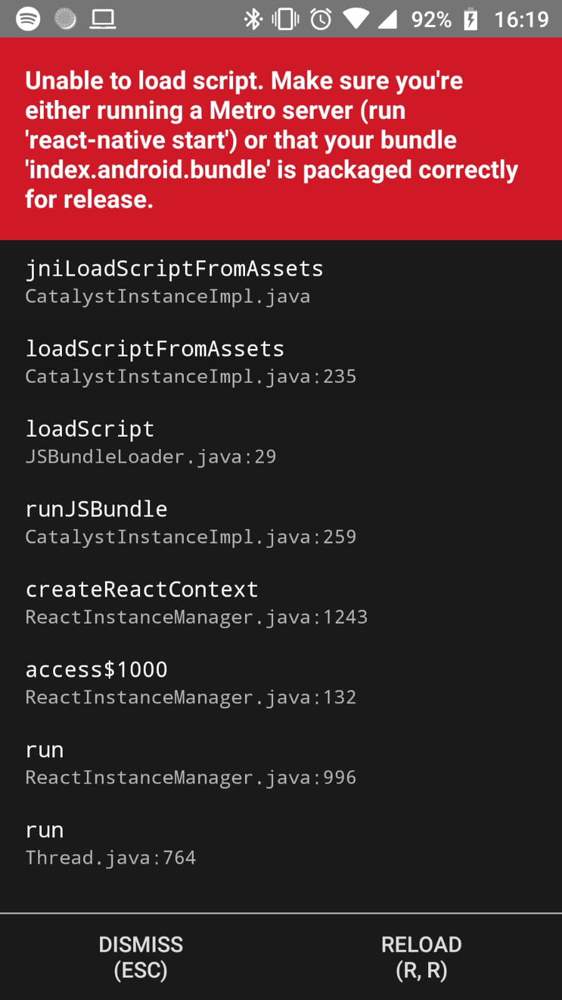

# plugged-computing-binary-numbers

Frontend da aplicação Plugged Computing, desenvolvido em React Native. Contando os pontos - Números Binários Para ter acesso ao guia de configuração e uso do projeto, acesse: https://pluggedcomputing.gitlab.io/ https://pluggedcomputing.gitlab.io/

## Tecnologias

- ### React Native
  React Native é uma biblioteca Javascript criada pelo Facebook. É usada para desenvolver aplicativos para os sistemas Android e IOS de forma nativa

## Padrão de commits

De modo geral, o padrão é da seguinte forma:

`type(scope): subject`

Para mais informações, acesse: https://pluggedcomputing.gitlab.io/post/20200123_commit_lint/

## Gerando versões

### Versão de produção:

`yarn release`

### Versão de desenvolvimento:

`yarn pre-release`

# Migrar ReactNative Expo para CLI

## 1: Configuração de ambiente e instalação do ReactNative CLI, seguindo os passos em https://reactnative.dev/docs/0.60/getting-started

## 2: Criar novo projeto ReactNative CLI com o comando `npx react-native init nome_projeto`

## 3: Copiar os arquivos `src`, `App.js` e para o arquivo `package.json` siga as instruções:

- Copie as dependências `dependencies` e `devDependencies` do arquivo `package.json` do projeto em expo para o projeto em cli.

* Remova `"react-native": "https://github.com/expo/react-native/archive/sdk-36.0.0.tar.gz"` e deixe apenas `"react-native": "0.62.2"`

## 4: Execute o comando npm install para baixar as dependências

## 5: Instalar dependência para o commitlint com `npm install -g @commitlint/cli @commitlint/config-conventional`

## 6: No terminal na raiz do projeto execute `echo "module.exports = {extends: ['@commitlint/config-conventional']}" > commitlint.config.js`

## 7: No arquivo `package.json` faça as seguintes alterações, depois execute o comando `npm install`:

- substiuição

  - "expo-linear-gradient": "~8.0.0" -> "react-native-linear-gradient": "^2.5.6"

  - "lottie-react-native": "~2.6.1" -> "lottie-ios": "3.1.3",
    "lottie-react-native": "^3.4.0"

- remoção

  - "@expo/vector-icons": "^10.0.6"

  - "expo": "~36.0.0"

  - "expo-constants": "~8.0.0"

  - "expo-font": "~8.0.0"

  - "babel-preset-expo": "~8.0.0",

* adicionar

  - "@react-native-community/async-storage": "^1.11.0"

## 8: No arquivo `App.js` copie e cole o codigo abaixo:

    import React from 'react';

    import {setCustomTextInput, setCustomText} from 'react-native-global-props';

    import Routes from './src/routes';
    import {general} from './src/styles';

    const customTextInputProps = {
    style: general.customProps,
    };

    const customTextProps = {
    style: general.customProps,
    };

    setCustomTextInput(customTextInputProps);
    setCustomText(customTextProps);

    const App = () => {
    return <Routes />;
    };

    export default App;

## 9: No `index.js` dos componentes `LoginOrRegister` e `ScreenAbout` faça:

- import {LinearGradient} from 'expo-linear-gradient' -> import LinearGradient from 'react-native-linear-gradient'

## 10: No `index.js` dos componentes `Congratulations` e `LevelSelection` faça:

- import {..., AsyncStorage, ...} -> import AsyncStorage from '@react-native-community/async-storage'

## 11: No `index.js` do componete `Exercises` faça:

- impot {MaterialCommunityIcons} from '@expo/vector-icons' -> import Icon from 'react-native-vector-icons/MaterialCommunityIcons'

* Modifique

  ```
  <MaterialCommunityIcons name="lightbulb-on-outline"
  size={general.iconSize.bigger}
  style={styles.icon}
  onPress={handleTips}
  ```

  Para

  ```
  <Icon .. name="lightbulb-on-outline"
  size={general.iconSize.bigger}
  style={styles.icon}
  onPress={handleTips}./>
  ```

- No terminal execute o comando `yarn add react-native-vector-icons`

## 12: Instalar dependência babel present-env com o comando `npm install --save-dev @babel/preset-env`

## 13: Adicionar configuração para Fonts faça:

- No terminal na raiz do projeto execute `echo "module.exports = {assets: ['./assets/fonts/Poppins'],};" > react-native.config.js`

- Na raiz do projeto crie as pastas `assets/fonts/Poppins/` depois copie e cole o conteudo da pasta `src/assets/fonts` dentro.

* Execute o seguinte codigo no terminal `react-native link`

## 14: Mudar versão minima do android, na pasta `android` no arquivo `build.gragle` mude minSdkVersion para 19

## 15: Para o ReactNative funcionar na versão 19 do android, faça os seguintes paços:

1. Abra o Android Studio va em `File` -> `open` -> `va até a pasta do prejeto` e depois selecione a pasta `android`

1. Em `Gradle Scripts` abra o arquivo `build.gragle(Module:app)`

1. Em `dependêncies` adicione o codigo a baixo, depois aperte em Sync Now

```
 implementation ("com.squareup.okhttp3:okhttp:3.12.12"){
      force = true //API 19 support
  }
  implementation 'com.squareup.okhttp3:logging-interceptor:3.12.12'
```

## 16: Rodar o projeto com o comando `npx react-native run-android`

## 17: Caso ocorra o erro da imagem a baixo, execute o comando `npx react-native start`



> Lembre-se de conferir o CHANGELOG.md

## Boas Praticas

### Obrigatórias

1. Todos os nomes de variaveis, funções e metodos devem ser em ingles.
2. Deve ser aplicado o _design pattern [Model View Controller (MVC)](https://www.geeksforgeeks.org/mvc-design-pattern/)_.
3. Por padrão usaremos **";"** no final dos comandos.
4. Deve-se utilizar um estilo de programação mais funcional, aproveitando-se dos metodos já existentes na lingaugem e das dependencias. **Nada de reinventar a roda...**
5. Todos os metodos devem ter um ou mais testes unitarios equivalentes. Usaremos o [Jest](https://jestjs.io/).
6. Utilizar a [integração Prettier + ESLint + Airbnb Style Guide + EditorConfig no VSCode](https://pluggedcomputing.gitlab.io/post/20190901_style_guide/)
7. Crie estilos dos componentes em arquivos separados.

### Opcionais

1. Utilizar comentarios nas funções e metodos e sempre que achar necessario.
2. Coloque os Scripts na Parte Final da Sua Página.
3. Declare Variáveis, Fora da Instrução For.
4. Use {} Ao Invés de New Object().
5. Use [] Ao Invés de New Array().
6. Use === Ao Invés de ==.
